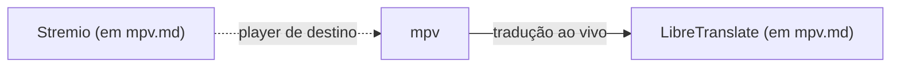

# Knowledge Docs — Índice

Grafo de conhecimento sobre subsistemas do repositório, para uso da IA.
Ver `.agents/rules/knowledge-docs.md` para quando/como manter isto.

Cada doc mapeia um subsistema cross-file: o quê, por quê, quais arquivos
fazem parte dele e como se liga a outros subsistemas. Novos docs entram
aqui conforme forem sendo criados — não é necessário documentar tudo de
uma vez.

## Docs existentes

| Doc | Resumo | Arquivos-chave |
|---|---|---|
| [mpv](mpv.md) | Player de vídeo com interpolação de frames, tradução ao vivo de legendas e pipeline de streaming (Crunchyroll/OBS) | `modules/nixos/packages-system.nix`, `config/mpv/`, `modules/nixos/crunchyroll-mpv.nix` |

## Grafo de relações

Aresta sólida = link forte (dependência real, quebra se o outro lado sumir).
Aresta tracejada = link fraco (relação incidental/cosmética).

*Nota:* `LibreTranslate` e `Stremio` ainda não têm doc próprio — estão
documentados como seções dentro de `mpv.md`. Se crescerem em complexidade
própria (mais scripts, mais integrações), promova-os a docs separados e
atualize este grafo.

## Convenções

- Nome do doc = nome do subsistema, em minúsculas (`mpv.md`, `voice-normalizer.md`).
- Um subsistema, um doc. Se um doc passar de ~150 linhas, considere dividir.
- Ao adicionar um doc novo: acrescente uma linha na tabela acima e um nó no
  grafo mermaid, com a força do link para os docs relacionados.
